# AOTrino


**Electron-like desktop apps on .NET Native AOT + WebView2.** One executable, no runtime to install, no Chromium
to ship — Windows already has both. x86, x64 and ARM64.

A window is a real HWND, the UI is a web page, and the two talk over a typed bridge. That's the whole idea. The
[Fluent UI gallery](#fluentui--gallery) below is an AOTrino app, and it weighs 4 MB.

```
dotnet new install AOTrino.Templates
dotnet new aotrino -o MyApp && cd MyApp
dotnet run
```

## The four levels

AOTrino is a stack of optional layers. Each one is useful without the ones above it, and **the bottom layer
alone is a first-class way to use it** — most of the samples here are a hand-written `index.html` and no npm at
all.

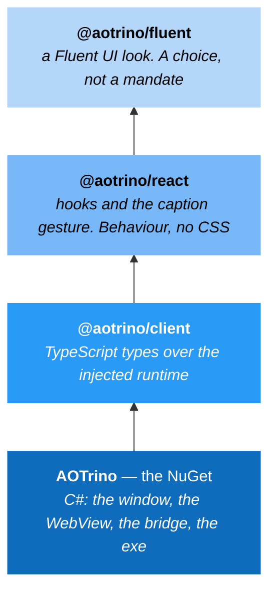

| Level | You write | You get | Start with |
|---|---|---|---|
| **Plain** | `index.html` | A window, and .NET at the other end of `chrome.webview.hostObjects` | `dotnet new aotrino` |
| **+ client** | TypeScript | The bridge, typed: `host<MyApi>()`, `appWindow`, shared buffers | `dotnet new aotrino` + `npm i @aotrino/client` |
| **+ react** | React | `useHostCall` / `useHostValue`, a drag region that maximizes on double-click | `dotnet new aotrino-react` |
| **+ fluent** | Fluent UI | A window that follows the Windows theme, caption included | `dotnet new aotrino-fluent` |

Nothing above the first level is required by the first level. And `@aotrino/client` adds **no runtime**: the C#
side already injected it, so the package is types and a thin wrapper over what's on the page — which is what
keeps the two from drifting apart.

### What an app is, in one picture

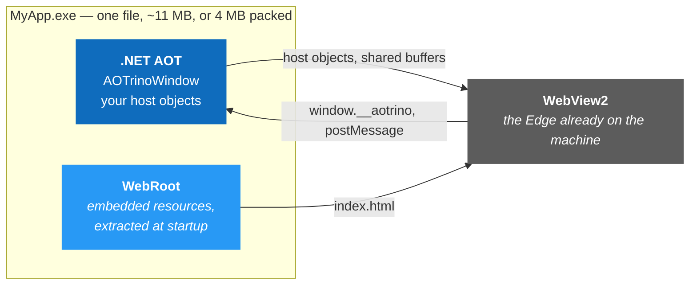

## Getting started

**To build and run**, the [.NET 10 SDK](https://dotnet.microsoft.com/download) is all you need. The **WebView2
runtime** is already on any up-to-date Windows — and an AOTrino app offers a download link if it isn't.

**To publish the single exe**, add the MSVC linker. The SDK compiles to native code but doesn't ship a linker,
so `dotnet publish` ends in `link.exe` and stops with *"Platform linker not found"* without it. No IDE required
— the standalone build tools are enough:

```
winget install Microsoft.VisualStudio.BuildTools --override "--passive --add Microsoft.VisualStudio.Workload.VCTools --includeRecommended"
```

Add `--add Microsoft.VisualStudio.Component.VC.Tools.ARM64` for ARM64. If you already have Visual Studio, the
same thing lives in the installer as **Desktop development with C++**. Full list:
[aka.ms/nativeaot-prerequisites](https://aka.ms/nativeaot-prerequisites).

### Plain — a page, no build step

```
dotnet new aotrino -o MyApp
cd MyApp && dotnet run
```

Three source files and a page. `WebRoot\dist\index.html` is embedded in the exe: edit it and rebuild. To call
.NET, register a host object:

```csharp
protected override void RegisterHostObjects() => AddHostObject("app", new MyApi(this));
```

```js
const api = chrome.webview.hostObjects.app;   // every member is async, even a property read
document.title = await api.getTitle();
```

### React

```
dotnet new aotrino-react -o MyApp
cd MyApp && dotnet run
```

`dotnet build` runs `npm install` and Vite for you. The caption is yours to style; the *behaviour* comes from
the package:

```tsx
import { TitleBar, useHostCall } from "@aotrino/react";

<TitleBar showMinimize showMaximize />        // drag, double-click to maximize, window buttons
const ping = useHostCall(() => api.ping());   // pending/result/error, no useEffect
```

### Fluent UI

```
dotnet new aotrino-fluent -o MyApp
cd MyApp && dotnet run
```

```tsx
<AOTrinoProvider>        {/* follows the Windows app theme, live */}
    <TitleBar />         {/* caption, window buttons and a theme picker, in Fluent's own tokens */}
    <MyContent />
</AOTrinoProvider>
```

### Shipping it and AOT publishing

```
dotnet publish -r win-x64 -c Release
```

One exe, about 11 MB, nothing to install alongside it. [UPX](https://upx.github.io/) takes x86/x64 to roughly
4 MB (it can't pack ARM64 yet). In this repo, `publish.bat -upx` does every sample for all three architectures
in one go.

Note: for AOT, ensure you have all the required prerequisites, documented at https://aka.ms/nativeaot-prerequisites, in particular the Desktop Development for C++ workload in Visual Studio.

## Samples

Twelve of them, in [Samples](Samples) — each one is a single idea. The level each is written at is noted: most
need **no npm at all**.

### Hello World

*Plain HTML.* The smallest AOTrino app: a window, a page, a version string. If you read one sample, read this
one — it's a complete desktop application in about 40 lines.

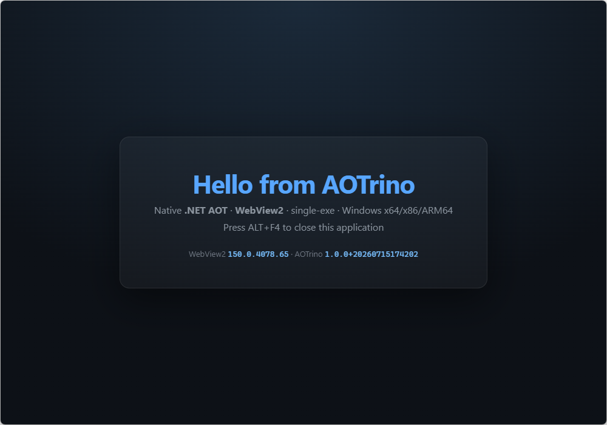

### Host Objects

*Plain HTML.* What crosses the bridge: properties, methods, `Task<T>` as a real promise, exceptions as
rejections, arrays, JSON. The live reference for [docs/BRIDGE.md](docs/BRIDGE.md).

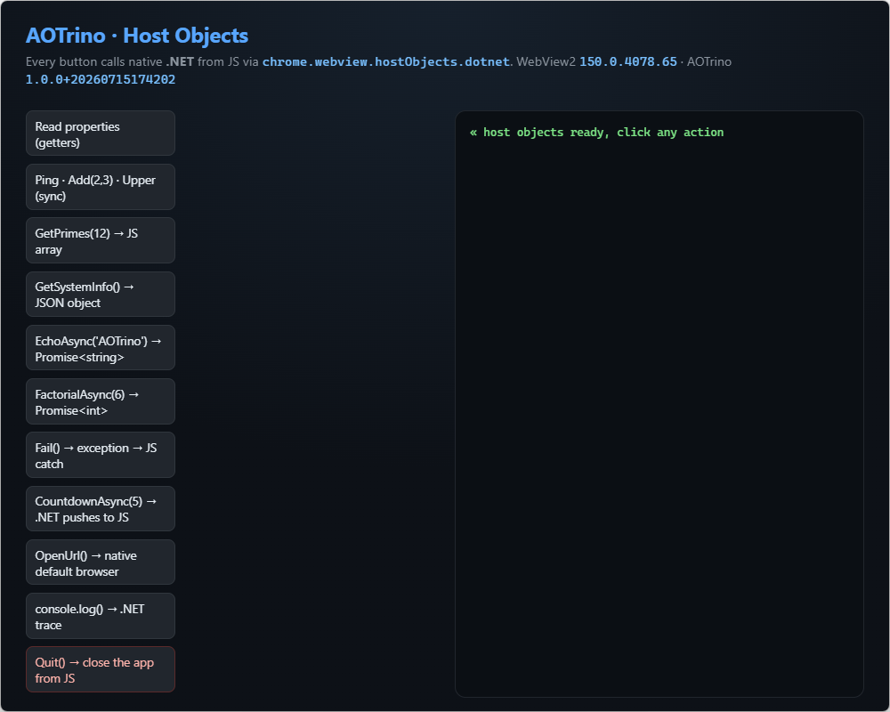

### Direct2D

*Plain HTML.* .NET draws with Direct2D into a **shared buffer** and the page shows it in a `<canvas>` with no
copy — the path for pixels, which the bridge is the wrong tool for.

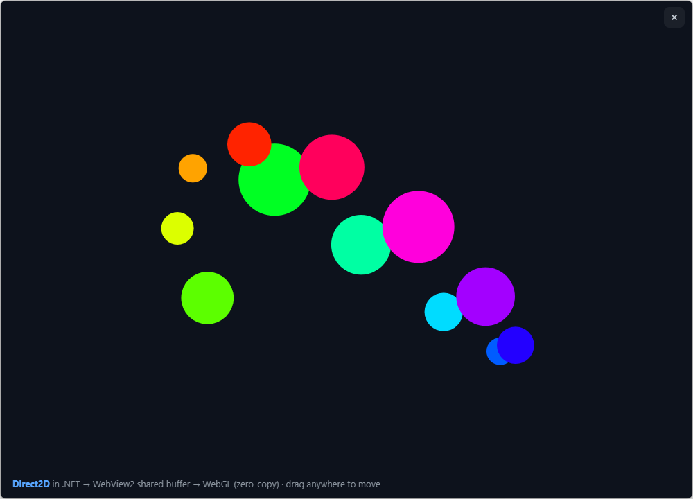

### Composition

*Plain HTML.* The two hosting models side by side in one process: the WebView as a composition visual (the
default) and as a classic child HWND. Same page, different windows.

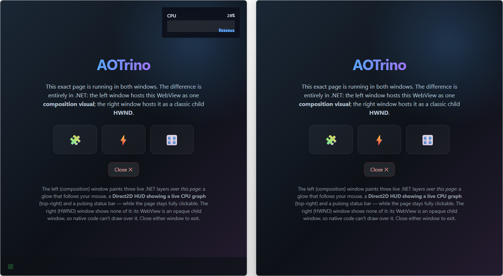

### Translucid

*Plain HTML.* A Windows 11 system backdrop — Mica, Acrylic, Tabbed — showing through a page that leaves its
edges transparent. Only possible because the WebView is a composition layer and not an opaque child window.

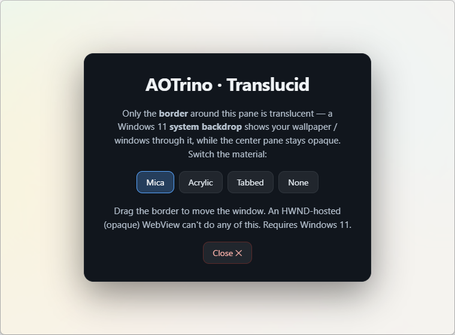

### Capture Screen

*Plain HTML.* The left half is the page; the right half is a live `Windows.Graphics.Capture` of the screen,
drawn with Direct2D and composited *beside* the page by .NET — which is not something a web page gets to do.

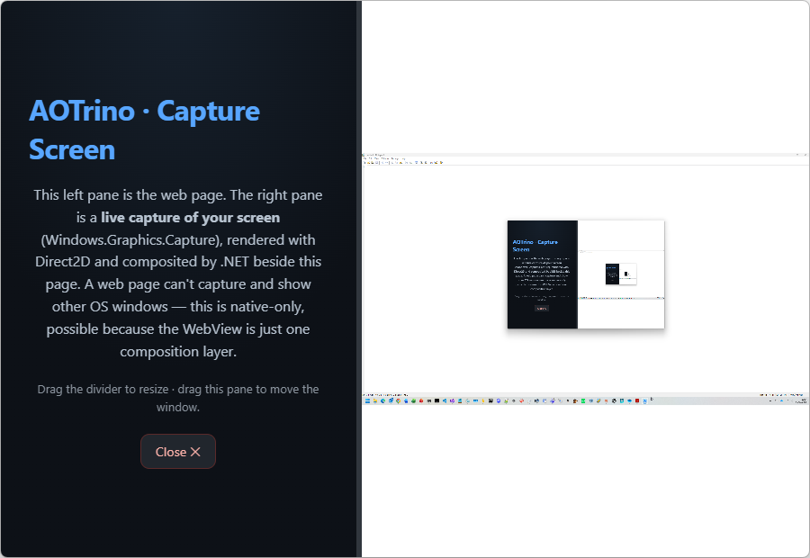

### Web Browser

*Plain HTML + an injected script.* `NavigationMode.Web`: the one sample that browses the real internet, its
chrome injected into every document. It registers **no host objects** — [docs/SECURITY.md](docs/SECURITY.md)
explains why that's worth being deliberate about. Takes `--url`.

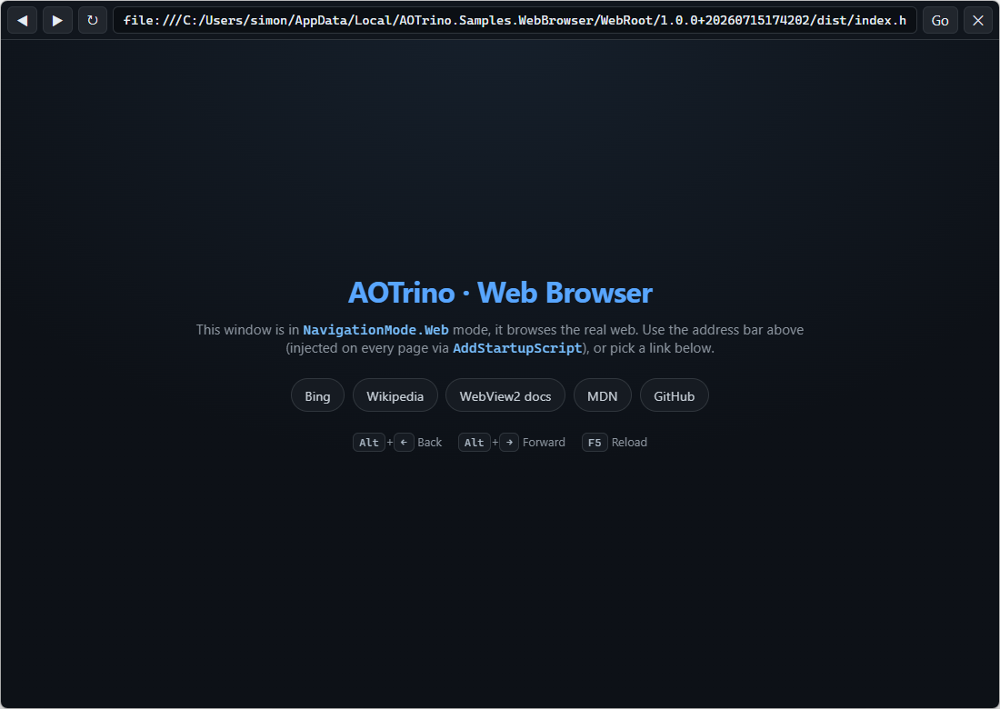

### File Explorer

*Plain HTML.* A local file browser over a host object, with a preview pane: what "a desktop app, not a web
page" actually buys. Also where `SystemInfo` is demonstrated.

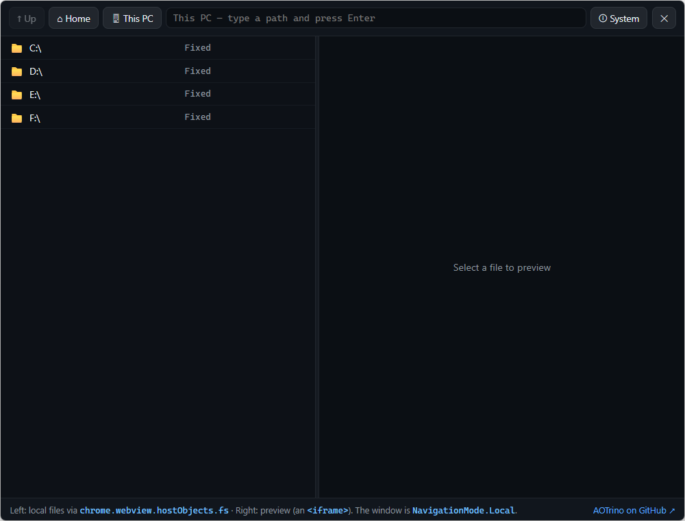

### React · Hello World

*React + @aotrino/client + @aotrino/react.* Hello World one level up: a typed host object, hooks, and a caption
whose drag and double-click come from the package rather than from this app.

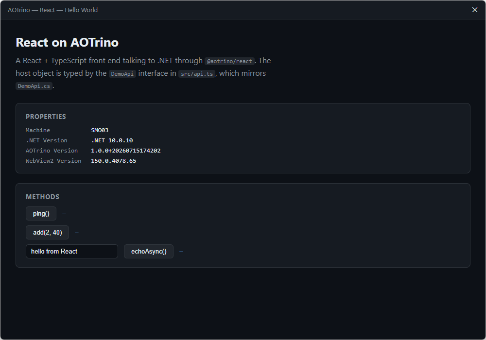

### React · Dashboard

*React + @aotrino/react.* Live .NET process state — working set, GC, threads — with auto-refresh. No
`useEffect`, no `Promise.all` and no polling timer in the app: the hooks own all of it.

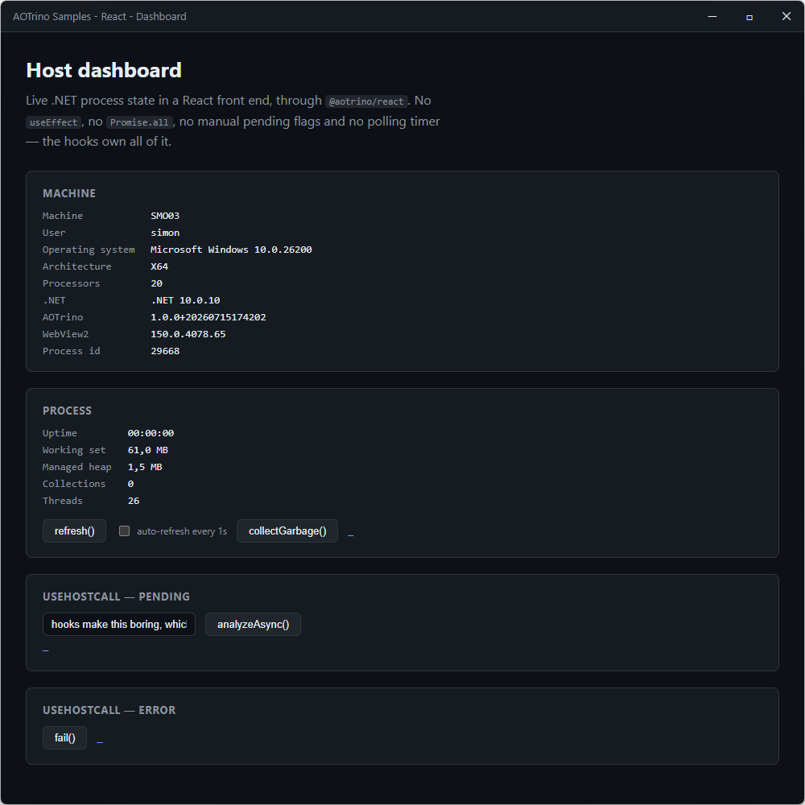

### FluentUI · Hello World

*Fluent UI — the whole pyramid.* One window that reads the host, calls .NET, and re-themes itself from the
caption's sun/moon button. Almost no CSS of its own: Fluent's tokens do it.

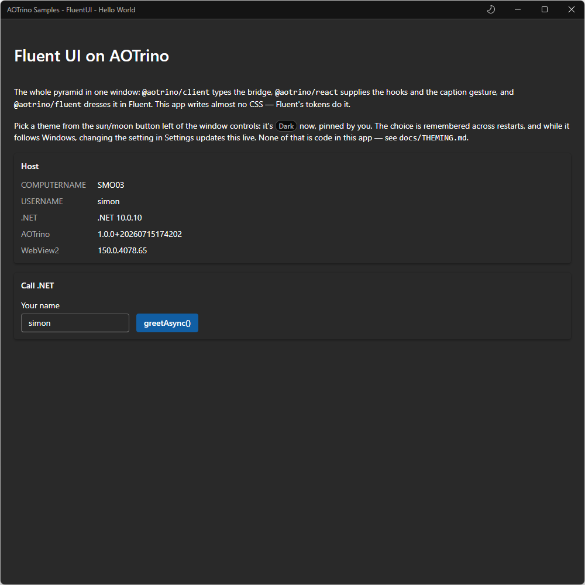

### FluentUI · Gallery

*Fluent UI — the flagship.* A WinUI-Gallery-shaped tour where every card is a live demo with the code that
produced it. Includes a table of **500,000 rows** that lives in .NET and crosses the bridge 200 at a time.

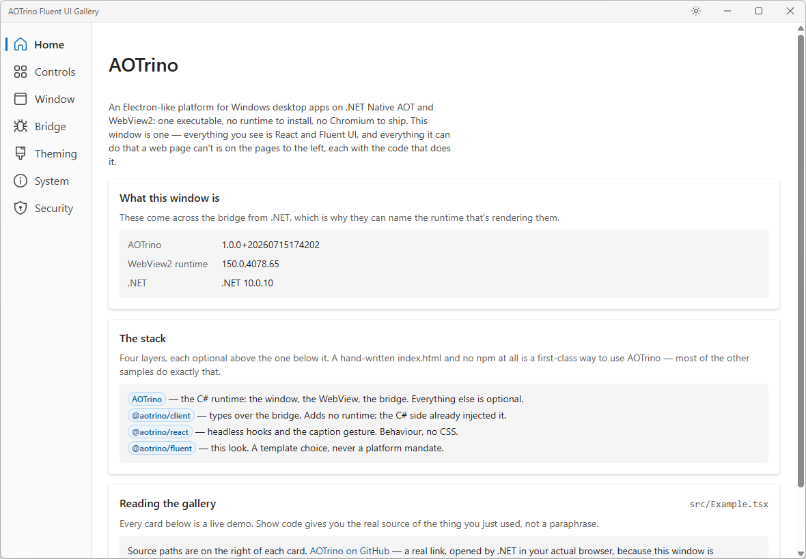

## Documentation

- [Architecture and maintenance](docs/MAINTENANCE.md) — what the repo is made of, where every version lives, what to do weekly/monthly/every six months, and the traps.
- [Security model](docs/SECURITY.md) — what the defaults are (local-first, `NavigationMode`), what they aren't, and where the decisions stay yours.
- [The bridge](docs/BRIDGE.md) — how JS calls .NET and back: host objects, what crosses, async results, exceptions, and the escape hatch.
- [Front end](docs/FRONTEND.md) — hand-written pages need nothing; the optional `@aotrino/client` types the bridge for React/TypeScript apps, without a registry.
- [Theming](docs/THEMING.md) — light/dark that follows Windows, picked from the caption and remembered — what the `FluentUI` samples get for two lines, and how to change it.

## Building this repo

```
git clone https://github.com/aelyo-softworks/AOTrino
dotnet build AOTrino.slnx
publish.bat -upx              rem every sample, AOT, x86 + x64 + ARM64, compressed
```

That should be all of it: the interop assemblies come from the published
[DirectNAot](https://www.nuget.org/packages/DirectNAot),
[DirectNAot.Extensions](https://www.nuget.org/packages/DirectNAot.Extensions) and
[WebView2Aot](https://www.nuget.org/packages/WebView2Aot) packages, and the build takes care of npm.

If you happen to be working on those libraries at the same time, drop their local builds into an `External\`
folder at the root: when it's there, the projects reference those DLLs instead of the packages, so a change in
DirectN can be tried here without a round trip through nuget.org. It's detected rather than configured —
`-p:UseLocalExternal=false` overrides it either way. See [docs/MAINTENANCE.md](docs/MAINTENANCE.md).

## License

MIT. See [LICENSE](LICENSE).
