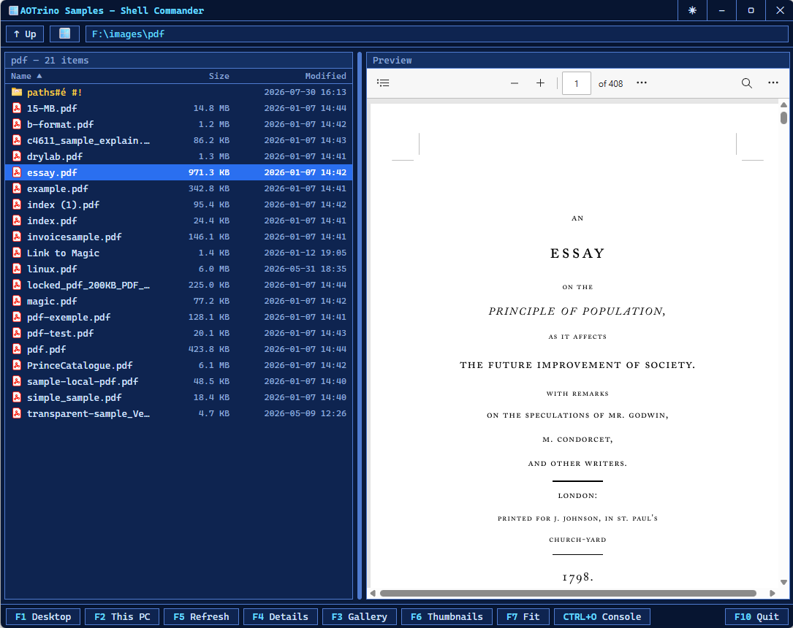
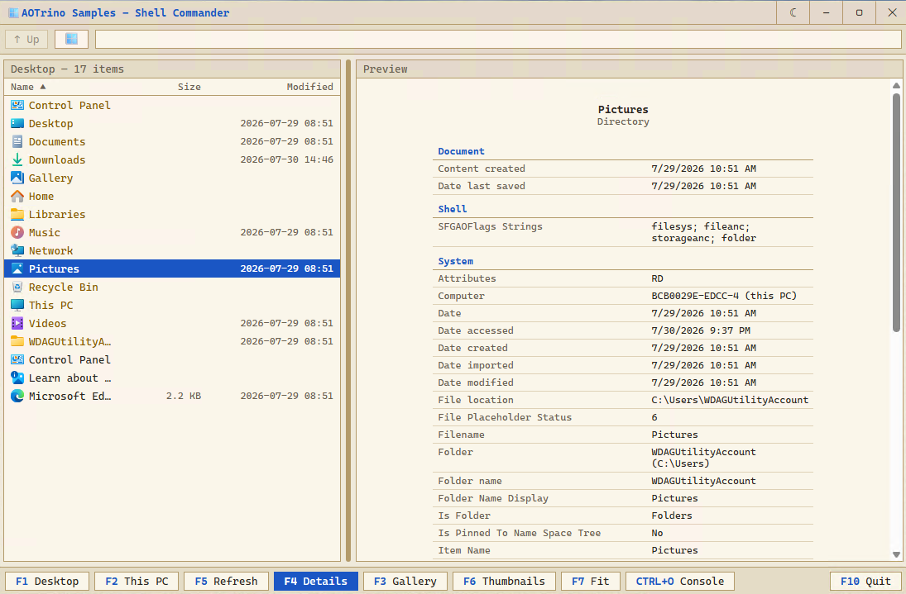
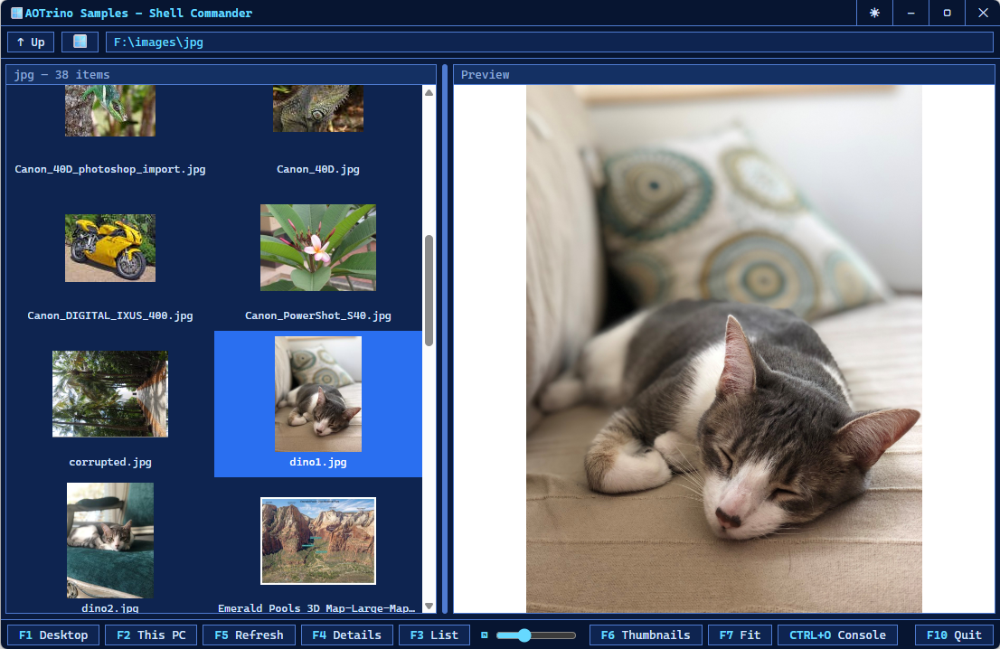
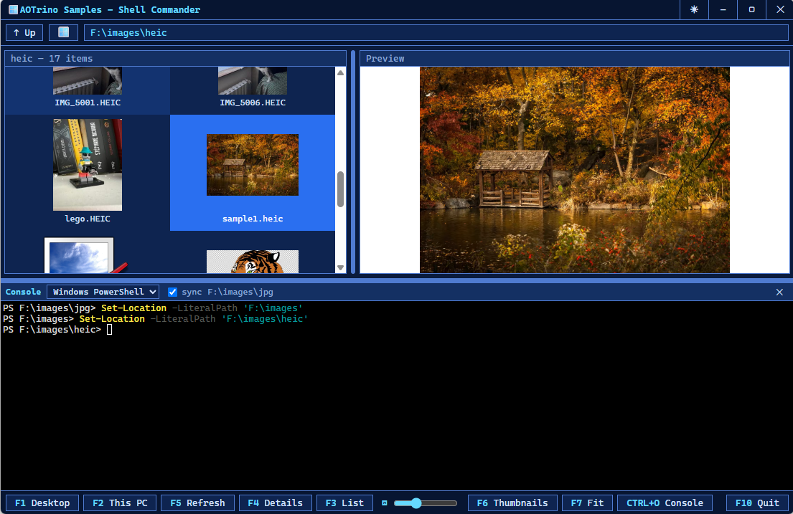

# Shell Commander

A retro, orthodox file manager that browses the whole **Windows shell namespace**, not just the file system. One
navigation pane, one live preview pane, a real console at the bottom, and the function-key bar the genre is named for.

The difference from [File Explorer](../AOTrino.Samples.FileExplorer) is the whole point of having both. That one walks
string paths. This one walks `IShellItem`/`IShellFolder` through the [ShellN.Extensions](https://www.nuget.org/packages/ShellN.Extensions)
NuGet, so the places a path cannot name are just more folders here.

## The shell namespace, not the file system

Everything the page navigates goes through one host object, `chrome.webview.hostObjects.shell`, and every item that
crosses the bridge is a shell **parsing name** rather than a path, which round-trips back through
`ShellItem.FromParsingName`. Because the backend is `IShellItem` and not a path string, the same code reaches places a
path cannot:

* **This PC, drives, libraries, network, Control Panel**, the virtual roots of the namespace.
* **A phone connected over USB**, an iPhone or an Android, whose storage speaks MTP (Media Transfer Protocol) and is a
  shell folder with no drive letter at all.
* **A `.zip` or `.7z` opened as a folder**, browsed in place, its entries listed and previewed like any other.

The path box takes a parsing name, a plain path, or a path with **environment variables**, so `%temp%`,
`%windir%\System32` and `%userprofile%\Documents` all resolve (`FromParsingName` does not expand them, the host does).
Type one and press Enter, and the box then shows the concrete location the shell resolved it to.

The Desktop is the root (empty id), This PC is `::{CLSID_MyComputer}`, and Up walks parent parsing names. None of it is
a special case in the UI, it is the same `ShellFolder` enumeration the whole way down.

*The shell namespace as folders: a phone over MTP and a media server sit beside the drives.*

## Real icons and thumbnails

The glyphs are not guessed from an extension. Each row asks the shell for the **real image** of its item through
`IShellItemImageFactory`, so a photo is its own thumbnail, a document is its registered icon, and F6 toggles between the
two (`SIIGBF_ICONONLY`). Two things keep that from being slow:

* **Extraction runs off the UI thread**, bounded by a semaphore, because the factory blocks on the calling thread while
  it computes the image. On the STA UI thread a folder of slow thumbnails would freeze the window. It also uses the
  **async** image call, so a factory that returns `E_PENDING` (not ready, retry) is retried rather than dropped.
* **Images are disk-cached as PNGs** in a temp folder that survives restarts, keyed by item, size and modified time and
  loaded back over `file://`. A revisited folder, or a reopened app, paints with no shell work at all.

*Gallery view: real shell thumbnails, at the size the F3 slider picks.*

## Previews: WebView2 and WIC together, for the widest reach

The preview pane hands each file to whatever can actually show it, and the two together cover far more than either
alone:

* **WebView2** renders what the engine documents it can, images, SVG, PDF, `<audio>`/`<video>`, text.
* **WIC** covers the rest. A `.heic`, a `.tiff`, anything an installed **Windows Imaging Component** codec can decode
  but the browser cannot, is decoded and shown.

What counts as previewable is read from **Windows**, not a hardcoded list: the perceived type from
`AssocGetPerceivedType`, the `audio/`·`video/` content types registered in `HKCR`, and the live set of installed WIC
decoders. And the source a preview loads is the item's own path when it is on disk, or a **shell copy** of it when it is
not, which is what makes a file inside a `.7z` previewable at all (some handlers offer no readable stream, but the shell
can always copy the item out).

Markdown is rendered on the .NET side with [Markdig](https://github.com/xoofx/markdig) and shown in a themed frame that
follows relative images and links and keeps a Back stack. And for a folder, an un-previewable file, or on demand (F4),
the pane shows a **details card**: the item's icon, type, and every value from its Windows **property store**, labelled
and formatted exactly as Explorer's details pane does it, grouped by category.

## A real Windows console

`Ctrl+O` opens a collapsible drawer with an actual shell in a **Windows pseudo console** (ConPTY), drawn by
[xterm.js](https://xtermjs.org/). It opens in the folder on screen, offers a picker of the shells it finds installed
(Windows PowerShell, PowerShell 7, Command Prompt, WSL bash), and with the *sync* box on, sends the shell a `cd`
whenever you navigate. Not a fake terminal echoing commands, the real thing with its own process.

Right-click a row for the **real Windows context menu**, the same one Explorer shows, with the shell-extension verbs
installed on the machine, not a menu reimplemented in HTML.

*Ctrl+O drops a real shell, its own process, into the folder on screen.*

## Live, and it keeps up

The folder on screen is watched with the shell's own change notifier ([`ChangeNotifier`](https://www.nuget.org/packages/ShellN.Extensions)),
so a file added, renamed, deleted or edited by any other program shows up here, with a small toast saying what happened.
Where the shell reports the change item by item, the one row is updated in place. Where it reports only that the folder
changed (some environments and network shares only do this), the folder is re-enumerated, and the selection, its
preview and the scroll position are put back.

And it stays fast at any size. The listing **streams**, the host returns the folder header at once and drains the rows
in the background, and the list is **virtualized**, only the rows actually in view exist in the DOM. A folder of tens of
thousands of items opens immediately and scrolls in constant time, sorted the whole way. There is also a gallery view
with a thumbnail-size slider (F3), sortable columns, and Reveal-in-Explorer.

Yes, going through the shell namespace as objects is a little slower than raw file access, that is the price of reaching
phones and archives and virtual places with the same code. Because it all streams and virtualizes, you do not feel it.

## Files worth reading

| File | What is in it |
| --- | --- |
| `ShellApi.cs` | The `shell` host object: streaming enumeration, icon/thumbnail extraction and cache, the preview pipeline, the property store. |
| `MainWindow.cs` | The window: the change notifier, the real context menu (posted, not called inline, so the modal menu does not deadlock the bridge), the `file://` opt-in. |
| `TerminalApi.cs`, `Terminal.cs` | The console: shell detection and the ConPTY session. |
| `WebRoot\dist\index.html` | The whole retro UI, list virtualization, gallery, previews, console and the change-notify handling. |
| `Strings.resx`, `LocalizationApi.cs` | Every user-facing string, in one `.resx`, handed to the page as a catalog. See [Localization](../AOTrino.Samples.Localization). |

Everything is themed light/dark following Windows (pinned from the caption and remembered), and every string is
localized through the same `.resx` mechanism as the [Localization](../AOTrino.Samples.Localization) sample.

## Building on the shell namespace

The whole point of the sample is that the Windows shell namespace is a public NuGet here, not redeclared interop:
[ShellN](https://www.nuget.org/packages/ShellN) and [ShellN.Extensions](https://www.nuget.org/packages/ShellN.Extensions)
bring `ShellItem`, `ShellFolder`, the file operations and the context menu, on the same DirectN the rest of AOTrino uses.

Run it with `dotnet run` from this folder.
